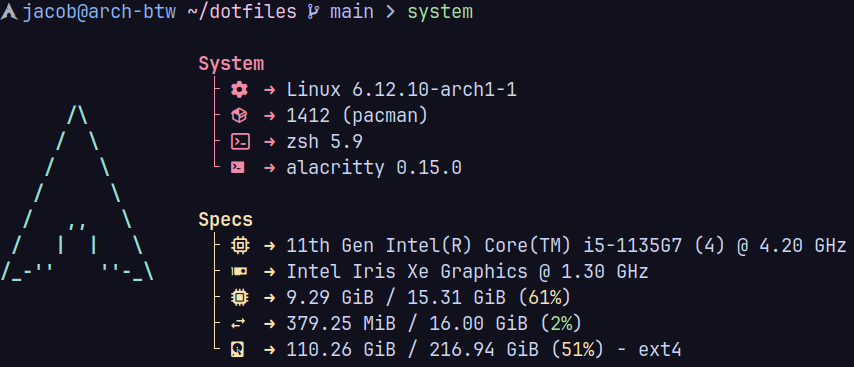

# dotfiles

> [!IMPORTANT]
> This is a very early version. 
> Expect some parts to be experimental and subject to change. 
> Not everything may be fully configured or optimized yet.

## 📷 Showcase




## 🔧  Setup Guide

1. Clone the repository:

    ```sh
    git clone https://github.com/Zelvios/dotfiles.git ~/dotfiles
    ```

2. Enter the cloned repository.

    ```sh
    cd ~/dotfiles
    ```

3. Run the [installation script](./installer/install.sh):

    ```
    ./install.sh
    ```

### Or, as an oneliner:

```sh
git clone https://github.com/Zelvios/dotfiles.git ~/dotfiles && cd ~/dotfiles && ./install.sh
```
