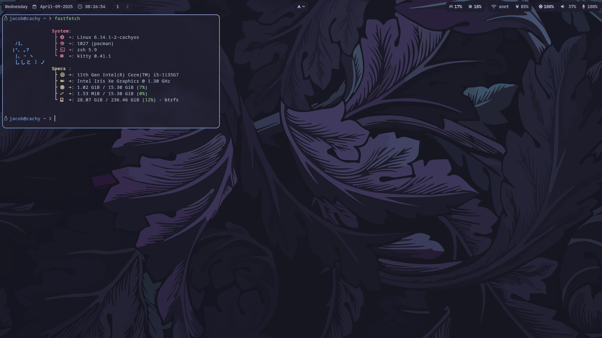

<h2 align="center"> ━━━━━━  ❖  ━━━━━━ </h2>

<!-- BADGES -->
<div align="center">

[](https://github.com/zelvios/dotfiles)
[](https://github.com/zelvios/dotfiles)
[](https://visitorbadge.io/status?path=https%3A%2F%2Fgithub.com%2Fzelvios%2Fdotfiles)
[](https://github.com/zelvios/dotfiles/blob/main/LICENSE.md)

</div>

<h2></h2>

# dotfiles

> [!IMPORTANT]
> This is a very early version. 
> Expect some parts to be experimental and subject to change. 
> Not everything may be fully configured or optimized yet.

## 🌿 <samp>About</samp>



This is my personal repository for my Arch dotfiles (always WIP)

Setup:

- Terminal: [`kitty`](https://github.com/kovidgoyal/kitty)
- Shell: [`zsh`](https://www.zsh.org/)
- Editor: [`neovim`](https://github.com/neovim/neovim)
- Panel: [`waybar`](https://github.com/Alexays/Waybar)
- Notification Manager: [`dunst`](https://github.com/dunst-project/dunst)
- Application Launcher: [`tofi`](https://github.com/philj56/tofi)
- File Manager: [`nautilus`](https://github.com/GNOME/nautilus)


## 📷 Showcase


## 🔧  Setup Guide

1. Clone the repository:

    ```sh
    git clone https://github.com/Zelvios/dotfiles.git ~/dotfiles
    ```

2. Enter the cloned repository.

    ```sh
    cd ~/dotfiles
    ```

3. Run the [installation script](./installer/install.sh):

    ```
    ./install.sh
    ```

### Or, as an oneliner:

```sh
git clone https://github.com/Zelvios/dotfiles.git ~/dotfiles && cd ~/dotfiles && ./install.sh
```
